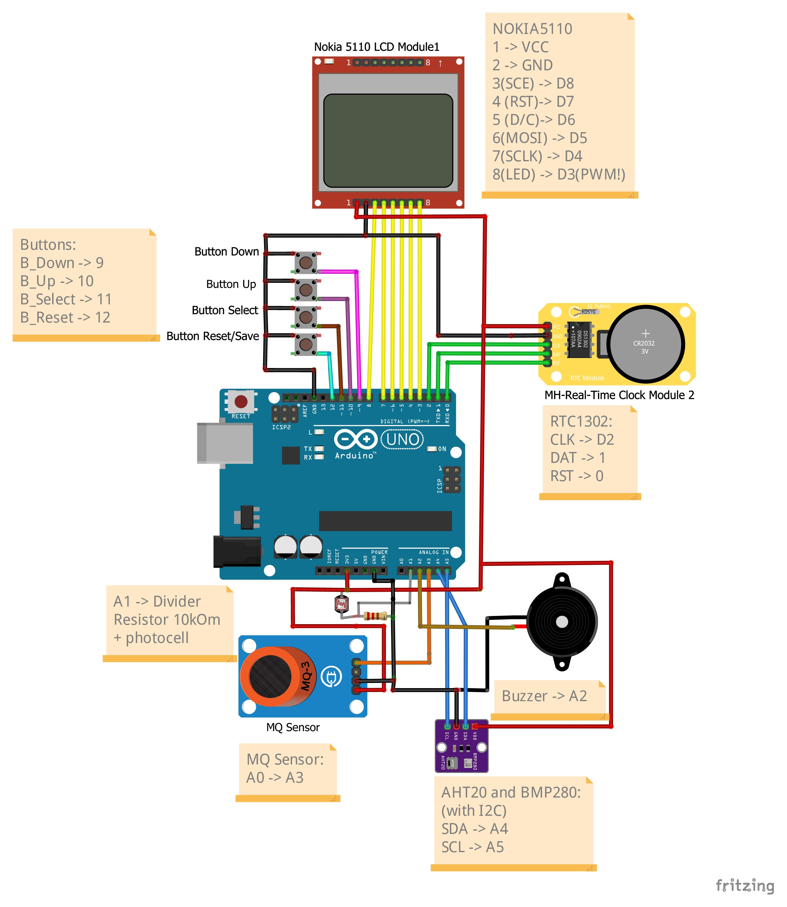
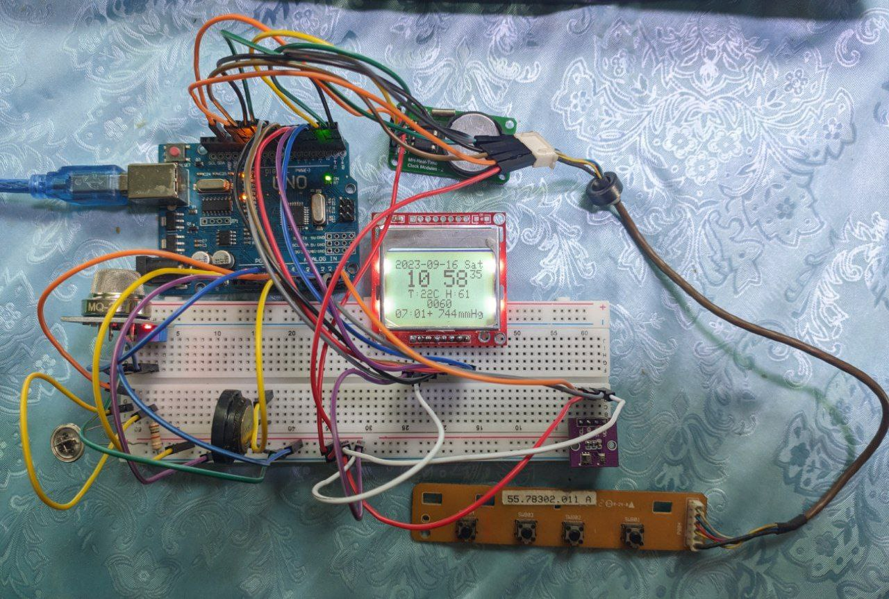

# Gas detection and Weather station

### The developed device is used as a gas leak detector and weather station

## Components
* Nokia 5110 
* RTC1302
* Arduino Nano/Uno
* MQ2 Sensor
* Buzzer
* AHT10 
* BMP280
* Resistor 10kOm
* Photocell
* 4 buttons

## Сonnection scheme

## View on a breadboard

